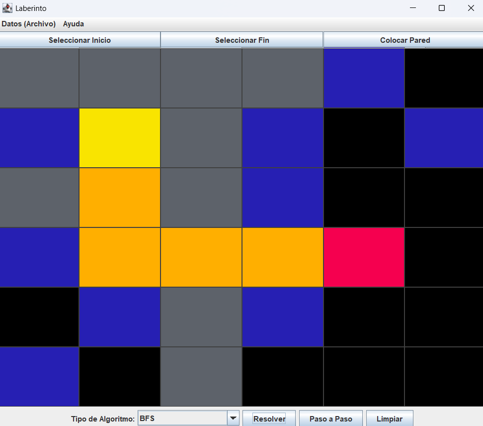
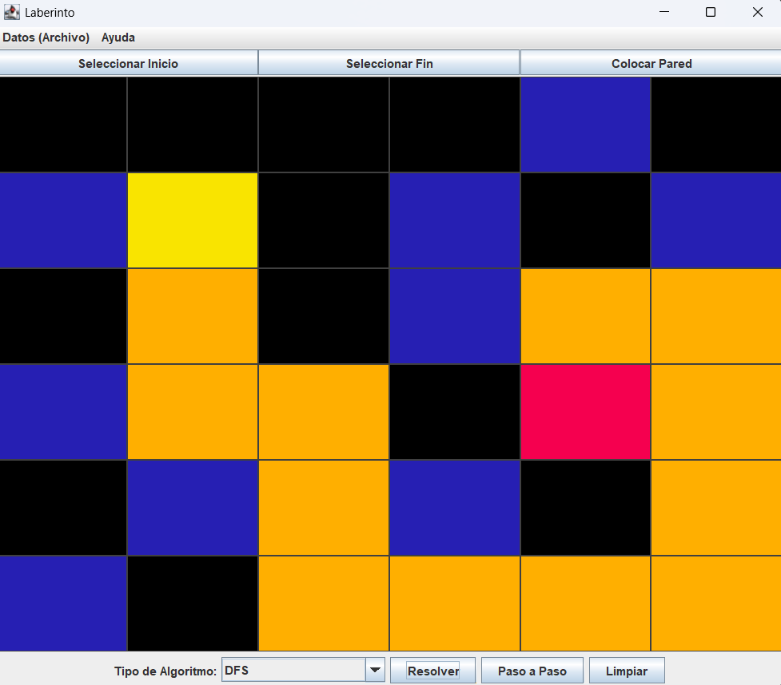

# Proyecto Final – Estructura de Datos: Resolución de Laberintos con Búsqueda y Optimización

Este proyecto implementa distintas estrategias algorítmicas para la resolución de laberintos, aplicando estructuras de datos, patrones de diseño y técnicas de programación orientada a objetos. El enfoque principal es comparar diversos algoritmos de búsqueda en un entorno visual basado en Java y Swing.

---
## 📌 Información General

- **Título:** Proyecto Final
- **Asignatura:** Estructura de Datos
- **Carrera:** Computación
- **Estudiantes:** Nicolás Cedillo y Mateo Miller
- **Correos:** ecedilloa@est.ups.edu.ec y mmillerm@est.ups.edu.ec
- **Fecha:** 29 de Julio de 2025
- **Profesor:** Ing. Pablo Torres

---

## Estructura del Proyecto (MVC + DAO)

```
src/
├── MazeApp.java                  # Punto de entrada principal
├── controllers/                 # Controlador general de interacción entre vista y modelo
│   └── MazeController.java
├── dao/                        # Interfaces de acceso a datos
│   ├── AlgorithmResultDAO.java
│   └── daoImpl/                # Implementaciones concretas de DAO
│       └── AlgorithmResultDAOFile.java
├── models/                     # Clases de datos y modelos lógicos
│   ├── AlgorithmResult.java
│   ├── Cell.java
│   ├── CellState.java
│   └── SolveResults.java
├── resources/                  # (Reservado para futuros assets)
├── solver/                     # Interfaces de algoritmos de resolución
│   ├── MazeSolver.java
│   └── solverImpl/             # Implementaciones de algoritmos
│       ├── MazeSolverBFS.java
│       ├── MazeSolverDFS.java
│       ├── MazeSolverRecursivo.java
│       ├── MazeSolverRecursivoCompleto.java
│       └── MazeSolverRecursivoCompletoBT.java
└── views/                      # Interfaz gráfica
    ├── MazeFrame.java
    ├── MazePanel.java
    └── ResultadosDialog.java   # Tabla y gráfica de resultados
```

---

## Descripción del Problema

Se busca resolver un laberinto representado como una matriz de celdas transitables o no transitables, buscando encontrar la ruta más corta entre un punto de inicio A y uno de destino B.

---

## Marco Teórico
Cada algoritmo está implementado en una clase diferente dentro de `solverImpl/`:

* Recursivo (2 direcciones)
* Recursivo (4 direcciones)
* Recursivo (4 direcciones + Backtracking)
* BFS (Breadth-First Search)
* DFS (Depth-First Search)

---

## Interfaz de Usuario (Java Swing)

* Permite seleccionar el tamaño del laberinto.
* Permite marcar celdas como inicio, fin o muro.
* Ejecuta el algoritmo seleccionado y muestra visualmente el camino encontrado.
* Visualiza resultados anteriores en una **tabla**.
* Opcion de graficar tiempos de ejecución por algoritmo usando **JFreeChart**.

---

## Resultados y Archivo de Registro

Los resultados se guardan en un archivo `results.csv`, utilizando un DAO (`AlgorithmResultDAO`) para mantener independencia de la lógica de persistencia.

Desde la interfaz:

* Se puede ver una tabla con: nombre del algoritmo, longitud del camino, tiempo de ejecución.
* Se puede graficar los tiempos por algoritmo.
* Se puede limpiar el archivo.


---

## UML 


---

## Capturas del Laberinto

* Captura del BFS


* Captura del DFS


---

## Codigo ejemplo (BFS)

- A continuacion, la explicacion del metodo BFS:

```java
/**
 * Implementación del algoritmo de Búsqueda en Anchura (BFS) para resolver laberintos.
 */
public class MazeSolverBFS implements MazeSolver {

    /**
     * Busca el camino más corto desde celdaInicio hasta celdaFin usando BFS.
     * 
     * @param matriz      Matriz de celdas del laberinto
     * @param celdaInicio Celda de inicio
     * @param celdaFin    Celda de destino
     * @return SolveResult con el recorrido y el camino encontrado
     */
    @Override
    public SolveResult getPath(Cell[][] matriz, Cell celdaInicio, Cell celdaFin) {

        // Obtiene las dimensiones de la matriz del laberinto
        int filas = matriz.length;
        int columnas = matriz[0].length;

        // Matriz para marcar las celdas visitadas
        boolean[][] visitado = new boolean[filas][columnas];
        // Mapa para reconstruir el camino desde el final hasta el inicio
        HashMap<Cell, Cell> mapaPadres = new HashMap<>();
        // Cola para la búsqueda BFS
        LinkedList<Cell> cola = new LinkedList<>();
        // Lista para registrar el recorrido de las celdas visitadas en orden
        ArrayList<Cell> recorrido = new ArrayList<>();

        // Se obtiene la referencia real de las celdas de inicio y fin en la matriz
        Cell inicio = matriz[celdaInicio.getFila()][celdaInicio.getColumna()];
        Cell fin = matriz[celdaFin.getFila()][celdaFin.getColumna()];

        // Se inicia la búsqueda añadiendo la celda de inicio a la cola
        cola.add(inicio);
        visitado[inicio.getFila()][inicio.getColumna()] = true;

        // Posibles movimientos: abajo, arriba, derecha, izquierda
        int[][] direcciones = { { 1, 0 }, { -1, 0 }, { 0, 1 }, { 0, -1 } };

        // Mientras la cola no esté vacía, sigue explorando el laberinto
        while (!cola.isEmpty()) {
            // Saca la siguiente celda a explorar
            Cell actual = cola.poll();
            // Agrega la celda al recorrido (todas las que fueron visitadas)
            recorrido.add(actual);

            // Si se llegó a la celda final, termina la búsqueda
            if (actual.equals(fin)) {
                break;
            }

            // Para cada dirección posible
            for (int[] dir : direcciones) {
                int nuevaFila = actual.getFila() + dir[0];
                int nuevaColumna = actual.getColumna() + dir[1];

                // Verifica que la nueva posición esté dentro de los límites de la matriz
                if (nuevaFila >= 0 && nuevaFila < filas && nuevaColumna >= 0 && nuevaColumna < columnas) {
                    Cell vecino = matriz[nuevaFila][nuevaColumna];
                    // Si el vecino no ha sido visitado y no es una pared
                    if (!visitado[nuevaFila][nuevaColumna] && vecino.getEstado() != CellState.PARED) {
                        // Marca como visitado, guarda el padre para reconstruir el camino y lo agrega a la cola
                        visitado[nuevaFila][nuevaColumna] = true;
                        mapaPadres.put(vecino, actual);
                        cola.add(vecino);
                    }
                }
            }
        }

        // Reconstrucción del camino desde el final hasta el inicio usando el mapa de padres
        List<Cell> camino = new ArrayList<>();
        Cell actual = fin;
        // Mientras haya padre para el nodo actual, se va agregando al camino
        while (mapaPadres.containsKey(actual)) {
            camino.add(actual);
            actual = mapaPadres.get(actual);
        }
        // Si se llegó correctamente al inicio, se agrega y se invierte la lista para mostrar el camino desde el inicio al fin
        if (actual.equals(inicio)) {
            camino.add(inicio);
            Collections.reverse(camino);
        } else {
            // Si no se pudo llegar al inicio, el camino está vacío (no hay solución)
            camino.clear(); 
        }
        // Devuelve el resultado con el recorrido y el camino hallado (si existe)
        return new SolveResult(recorrido, camino);
    }

}
```

---

## Conclusiones

* Nicolas Cedillo: El algoritmo BFS (Búsqueda en Anchura) es especialmente recomendable cuando se necesita encontrar el camino más corto en un laberinto o grafo. Esto lo convierte en la opción ideal si el objetivo es optimizar la cantidad de pasos desde un punto de inicio hasta un destino, ya que BFS explora todas las rutas posibles por niveles. Además, es útil en situaciones donde se requiere explorar todas las posiciones alcanzables a cierta distancia del origen. BFS es el método preferido cuando el grafo es pequeño o moderado en tamaño, ya que su consumo de memoria puede crecer considerablemente en escenarios muy grandes. En resumen, BFS es la mejor alternativa cuando la prioridad es encontrar caminos mínimos de forma garantizada en grafos pequeños para ahorrar memoria.


---

## Recomendaciones y Aplicaciones futuras

* En futuras versiones se podría incorporar memoización o tabulación para reducir la complejidad temporal en algunos algoritmos recursivos.

* Incorporar más algoritmos de resolución de laberintos, y permitir que los usuarios comparen sus resultados en términos de eficiencia y recursos utilizados. Complementariamente, se podrían implementar métricas adicionales, como el consumo de memoria, la cantidad de nodos expandidos y el análisis de complejidad temporal/espacial. Esto enriquecería el proyecto para propósitos educativos y de investigación.

---

## Contribuciones

* Nicolas Cedillo - Estudiante
* Mateo Miller - Estudiante
